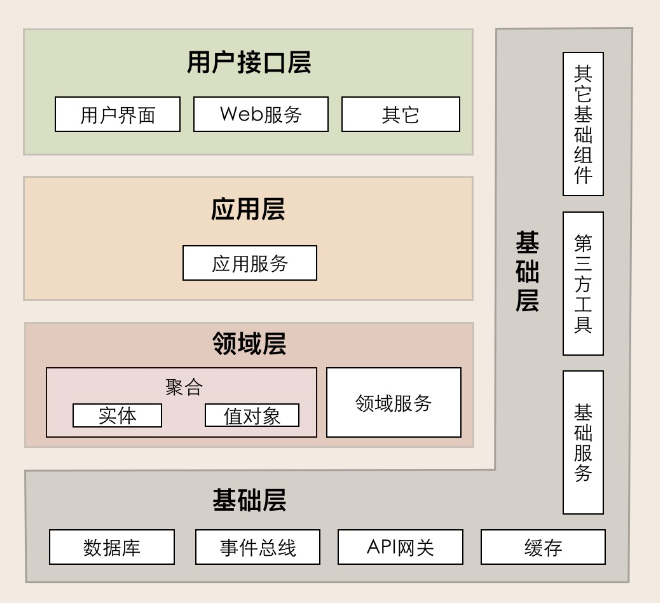

# 领域驱动设计

## DDD是什么？

DDD全称 Domain Driven Design（领域驱动设计），由埃里克·埃文斯于2004年发表，其核心思想是通过领域驱动设计方法定义领域模型，从而确定业务和应用边界，保证业务模型与代码模型的一致性。

## DDD与微服务

微服务中合理的划分服务是一个重要的内容，如何进行微服务边界确定及划分就可以利用到DDD。利用 DDD 来建立领域模型，划分领域边界，再根据这些领域边界从业务视角来划分微服务边界。按照 DDD 方法设计出的微服务的业务和应用边界一般都非常合理，可以很好地实现微服务内部和外部的“高内聚、低耦合”。

## 战略设计和战术设计

DDD主要包括战略设计和战术设计两大部分。

战略设计主要从业务视角出发，建立业务领域模型，划分领域边界，建立通用语言的限界上下文，限界上下文可以作为微服务设计的参考边界。

战术设计则从技术视角出发，侧重于领域模型的技术实现，完成软件开发和落地，包括：聚合根、实体、值对象、领域服务、应用服务和资源库等代码逻辑的设计和实现。

### 战略设计

DDD 战略设计会建立领域模型，领域模型可以用于指导微服务的设计和拆分。事件风暴是建立领域模型的主要方法，它是一个从发散到收敛的过程。它通常采用用例分析、场景分析和用户旅程分析，尽可能全面不遗漏地分解业务领域，并梳理领域对象之间的关系，这是一个发散的过程。事件风暴过程会产生很多的实体、命令、事件等领域对象，我们将这些领域对象从不同的维度进行聚类，形成如聚合、限界上下文等边界，建立领域模型，这就是一个收敛的过程。

**划定领域模型三大步骤**

- 在事件风暴中梳理业务过程中的用户操作、事件以及外部依赖关系等，根据这些要素梳理出领域实体等领域对象。
- 根据领域实体之间的业务关联性，将业务紧密相关的实体进行组合形成聚合，同时确定聚合中的聚合根、值对象和实体。在这个图里，聚合之间的边界是第一层边界，它们在同一个微服务实例中运行，这个边界是逻辑边界，所以用虚线表示。
- 根据业务及语义边界等因素，将一个或者多个聚合划定在一个限界上下文内，形成领域模型。在这个图里，限界上下文之间的边界是第二层边界，这一层边界可能就是未来微服务的边界，不同限界上下文内的领域逻辑被隔离在不同的微服务实例中运行，物理上相互隔离，所以是物理边界，边界之间用实线来表示。

#### 战略设计中重要概念

#### 领域、子域、核心域、通用域和支撑域

**领域**

- 在研究和解决业务问题时，DDD 会按照一定的规则将业务领域进行细分，当领域细分到一定的程度后，DDD 会将问题范围限定在特定的边界内，在这个边界内建立领域模型，进而用代码实现该领域模型，解决相应的业务问题。简言之，DDD 的领域就是这个边界内要解决的业务问题域。

**子域**

- 领域是用来限定业务边界和范围的，领域的进一步划分就成为了子领域，每个子域对应一个更小的问题域或更小的业务范围。

**核心域、通用域和支撑域**
三者为子域根据自身重要性和功能属性的分类。

- **核心域**：决定产品和公司核心竞争力的子域，是业务成功的主要因素和公司的核心竞争力
- **通用域**：没有太多个性化的诉求，同时被多个子域使用的通用功能子域
- **支撑域**：必需但既不包含决定产品和公司核心竞争力的功能，也不包含通用功能的子域

#### 通用语言

在事件风暴过程中，通过团队交流达成共识的，能够简单、清晰、准确描述业务涵义和规则的语言就是通用语言。它可以解决交流障碍这个问题，使领域专家和开发人员能够协同合作，从而确保业务需求的正确表达。

通用语言中的名词可以给领域对象命名，如商品、订单等，对应实体对象；而动词则表示一个动作或事件，如商品已下单、订单已付款等，对应领域事件或者命令。

#### 限界上下文

通用语言也有它的上下文环境。为了避免同样的概念或语义在不同的上下文环境中产生歧义，DDD 在战略设计上提出了“限界上下文”这个概念，用来确定语义所在的领域边界。

我们可以将限界上下文拆解为两个词：限界和上下文。限界就是领域的边界，而上下文则是语义环境。通过领域的限界上下文，我们就可以在统一的领域边界内用统一的语言进行交流。

限界上下文的定义就是：用来封装通用语言和领域对象，提供上下文环境，保证在领域之内的一些术语、业务相关对象等（通用语言）有一个确切的含义，没有二义性。这个边界定义了模型的适用范围，使团队所有成员能够明确地知道什么应该在模型中实现，什么不应该在模型中实现。

**限界上下文和微服务**
领域可以拆分为多个子领域，子域还可根据需要进一步拆分为子子域，子域可能会包含多个限界上下文，也有可能子域本身的边界就是限界上下文边界。每个领域模型都有它对应的限界上下文，团队在限界上下文内用通用语言交流。领域内所有限界上下文的领域模型构成整个领域的领域模型。理论上限界上下文就是微服务的边界。我们将限界上下文内的领域模型映射到微服务，就完成了从问题域到软件的解决方案。

#### 事件风暴
事件风暴正是 DDD 战略设计中经常使用的一种方法，它可以快速分析和分解复杂的业务领域，完成领域建模。事件风暴是一项团队活动，领域专家与项目团队通过头脑风暴的形式，罗列出领域中所有的领域事件，整合之后形成最终的领域事件集合，然后对每一个事件，标注出导致该事件的命令，再为每一个事件标注出命令发起方的角色。命令可以是用户发起，也可以是第三方系统调用或者定时器触发等，最后对事件进行分类，整理出实体、聚合、聚合根以及限界上下文。

### 战术设计

战术设计更多的贴近于技术实现，从技术视角出发，侧重于领域模型的技术实现，完成软件开发和落地，能够更多的贴合进技术编码之中。

#### 战术设计中重要概念

#### 实体和值对象

在战略设计时，实体是领域模型的一个重要对象。领域模型中的实体是多个属性、操作或行为的载体。在事件风暴中，我们可以根据命令、操作或者事件，找出产生这些行为的业务实体对象，进而按照一定的业务规则将依存度高和业务关联紧密的多个实体对象和值对象进行聚类，形成聚合。实体和值对象是组成领域模型的基础单元。

**实体**

- 在 DDD 中有这样一类对象，它们拥有唯一标识符，且标识符在历经各种状态变更后仍能保持一致。对这些对象而言，重要的不是其属性，而是其延续性和标识，对象的延续性和标识会跨越甚至超出软件的生命周期。我们把这样的对象称为实体。

**实体的特点**

- 有 ID 标识，通过 ID 判断相等性，ID 在聚合内唯一即可。状态可变，它依附于聚合根，其生命周期由聚合根管理。实体一般会持久化，但与数据库持久化对象不一定是一对一的关系。实体可以引用聚合内的聚合根、实体和值对象。

**值对象**

- 通过对象属性值来识别的对象，它将多个相关属性组合为一个概念整体，这就称之为值对象。

**值对象的特点**

- 无 ID，不可变，无生命周期，用完即扔。值对象之间通过属性值判断相等性。它的核心本质是值，是一组概念完整的属性组成的集合，用于描述实体的状态和特征。值对象尽量只引用值对象。

#### 聚合和聚合根

**聚合**

- 聚合由业务和逻辑紧密关联的实体和值对象组合而成的，聚合是数据修改和持久化的基本单元，每一个聚合对应一个仓储，实现数据的持久化。聚合在 DDD 分层架构里属于领域层，领域层包含了多个聚合，共同实现核心业务逻辑。聚合内实体以充血模型实现个体业务能力，以及业务逻辑的高内聚。跨多个实体的业务逻辑通过领域服务来实现，跨多个聚合的业务逻辑通过应用服务来实现。

**聚合的特点**

- 高内聚、低耦合，它是领域模型中最底层的边界，可以作为拆分微服务的最小单位，但我不建议你对微服务过度拆分。但在对性能有极致要求的场景中，聚合可以独立作为一个微服务，以满足版本的高频发布和极致的弹性伸缩能力。

**聚合根**

- 聚合根的主要目的是为了避免由于复杂数据模型缺少统一的业务规则控制，而导致聚合、实体之间数据不一致性的问题。聚合根也称为根实体，它不仅是实体，还是聚合的管理者。首先它作为实体本身，拥有实体的属性和业务行为，实现自身的业务逻辑。其次它作为聚合的管理者，在聚合内部负责协调实体和值对象按照固定的业务规则协同完成共同的业务逻辑。最后在聚合之间，它还是聚合对外的接口人，以聚合根 ID 关联的方式接受外部任务和请求，在上下文内实现聚合之间的业务协同。

**聚合根的特点**

- 聚合根是实体，有实体的特点，具有全局唯一标识，有独立的生命周期。一个聚合只有一个聚合根，聚合根在聚合内对实体和值对象采用直接对象引用的方式进行组织和协调，聚合根与聚合根之间通过 ID 关联的方式实现聚合之间的协同。

**聚合的设计流程**

- 采用事件风暴，根据业务行为，梳理出在过程中发生这些行为的所有的实体和值对象
- 从众多实体中选出适合作为对象管理者的根实体，也就是聚合根
- 根据业务单一职责和高内聚原则，找出与聚合根关联的所有紧密依赖的实体和值对象
- 在聚合内根据聚合根、实体和值对象的依赖关系，画出对象的引用和依赖模型
- 多个聚合根据业务语义和上下文一起划分到同一个限界上下文内

**聚合的设计原则**

- 在一致性边界内建模真正的不变条件
- 设计小聚合
- 通过唯一标识引用其它聚合
- 在边界之外使用最终一致性
- 通过应用层实现跨聚合的服务调用

#### 领域事件

领域事件用来表示领域中发生的事件。一个领域事件将导致进一步的业务操作，在实现业务解耦的同时，还有助于形成完整的业务闭环。领域事件可以是业务流程的一个步骤，也可能是定时批处理过程中发生的事件，或者一个事件发生后触发的后续动作。

**如何试别领域事件？**

利用关键词进行捕捉：“如果发生……，则……”“当做完……的时候，请通知……”“发生……时，则……”等。在这些场景中，如果发生某种事件后，会触发进一步的操作，那么这个事件很可能就是领域事件。

**领域事件为何要使用最终一致性？**

聚合的一个设计原则：在边界之外使用最终一致性。一次事务最多只能更改一个聚合的状态。如果一次业务操作涉及多个聚合状态的更改，应采用领域事件的最终一致性。

领域事件驱动设计可以切断领域模型之间的强依赖关系，事件发布完成后，发布方不必关心后续订阅方事件处理是否成功，这样可以实现领域模型的解耦，维护领域模型的独立性和数据的一致性。在领域模型映射到微服务系统架构时，领域事件可以解耦微服务，微服务之间的数据不必要求强一致性，而是基于事件的最终一致性。

领域事件可能发生在微服务内的聚合之间，也可能发生在微服务之间
- 微服务内的领域事件
  - 领域事件发生后完成事件实体构建和事件数据持久化，发布方聚合将事件发布到事件总线，订阅方接收事件数据完成后续业务操作。微服务内大部分事件的集成，都发生在同一个进程内，进程自身可以很好地控制事务，因此不一定需要引入消息中间件。但一个事件如果同时更新多个聚合，按照 DDD“一次事务只更新一个聚合”的原则，你就要考虑是否引入事件总线。但微服务内的事件总线，可能会增加开发的复杂度，因此你需要结合应用复杂度和收益进行综合考虑。
- 微服务之间的领域事件
  - 跨微服务的领域事件会在不同的限界上下文或领域模型之间实现业务协作，其主要目的是实现微服务解耦，减轻微服务之间实时服务访问的压力。领域事件发生在微服务之间的场景比较多，事件处理的机制也更加复杂。跨微服务的事件可以推动业务流程或者数据在不同的子域或微服务间直接流转。跨微服务的事件机制要总体考虑事件构建、发布和订阅、事件数据持久化、消息中间件，甚至事件数据持久化时还可能需要考虑引入分布式事务机制等。微服务之间的访问也可以采用应用服务直接调用的方式，实现数据和服务的实时访问，弊端就是跨微服务的数据同时变更需要引入分布式事务，以确保数据的一致性。分布式事务机制会影响系统性能，增加微服务之间的耦合，所以我们还是要尽量避免使用分布式事务。

### DDD分层架构
DDD分层架构分为多种模式，包含四层架构、五层架构以及六边形架构

### 四层架构
四层架构从上往下依次为用户接口层、应用层、领域层以及基础层

### 五层架构(DCI)
五层架构主要是在四层架构之上，在领域层和应用层之间加了上下文环境层

### 分层架构下的微服务
分层架构中微服务内分为四层分别为用户接口层、应用层、领域层以及基础层，设计采用依赖倒置，上层只允许调用下一层不允许跨层调用。
- 用户接口层
  - 主要存放用户接口层与前端交互、展现数据相关的代码。前端应用通过这一层的接口，向应用服务获取展现所需的数据。这一层主要用来处理用户发送的 Restful 请求，解析用户输入的配置文件，并将数据传递给应用层。数据的组装、数据传输格式以及 Facade 接口等代码都会放在这一层目录里。
- 应用层
  - 主要存放应用层服务组合和编排相关的代码。应用服务向下基于微服务内的领域服务或外部微服务的应用服务完成服务的编排和组合，向上为用户接口层提供各种应用数据展现支持服务。应用服务和事件等代码会放在这一层目录里。
- 领域层
  - 主要存放领域层核心业务逻辑相关的代码。领域层可以包含多个聚合代码包，它们共同实现领域模型的核心业务逻辑。聚合以及聚合内的实体、方法、领域服务和事件等代码会放在这一层目录里。
- 基础层
  - 主要存放基础资源服务相关的代码，为其它各层提供的通用技术能力、三方软件包、数据库服务、配置和基础资源服务的代码都会放在这一层目录里。

**参考**
1.《DDD实战课:基于DDD的微服务拆分与设计》