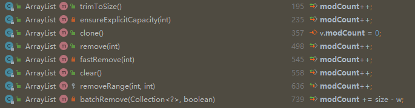
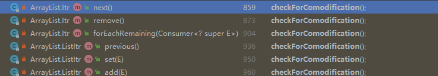

### 简单的一个ArrayList案例

```java
    public static void main(String[] args) {
        List<String> list = new ArrayList<>();
        list.add("1");
        list.add("2");
        list.add("3");
        for (String s : list){
            if ("1".equals(s)){
                list.remove(s);
            }
        }
    }
```

- 代码会正常执行吗？
  - 不会，那会导致什么？
  - 数组越界？


直接执行一下：

```java
Connected to the target VM, address: '127.0.0.1:64296', transport: 'socket'
Exception in thread "main" java.util.ConcurrentModificationException
	at java.util.ArrayList$Itr.checkForComodification(ArrayList.java:909)
	at java.util.ArrayList$Itr.next(ArrayList.java:859)
	at com.demo.demo.DemoApplicationTests.main(DemoApplicationTests.java:369)
```


介绍一下这个异常：

```java
ConcurrentModificationException 并发修改异常

* This exception may be thrown by methods that have detected concurrent
 * modification of an object when such modification is not permissible.
 * <p>
 * For example, it is not generally permissible for one thread to modify a Collection
 * while another thread is iterating over it.  In general, the results of the
 * iteration are undefined under these circumstances.  Some Iterator
 * implementations (including those of all the general purpose collection implementations
 * provided by the JRE) may choose to throw this exception if this behavior is
 * detected.  Iterators that do this are known as <i>fail-fast</i> iterators,
 * as they fail quickly and cleanly, rather that risking arbitrary,
 * non-deterministic behavior at an undetermined time in the future.
 * <p>
 * Note that this exception does not always indicate that an object has
 * been concurrently modified by a <i>different</i> thread.  If a single
 * thread issues a sequence of method invocations that violates the
 * contract of an object, the object may throw this exception.  For
 * example, if a thread modifies a collection directly while it is
 * iterating over the collection with a fail-fast iterator, the iterator
 * will throw this exception.
 *
 * <p>Note that fail-fast behavior cannot be guaranteed as it is, generally
 * speaking, impossible to make any hard guarantees in the presence of
 * unsynchronized concurrent modification.  Fail-fast operations
 * throw {@code ConcurrentModificationException} on a best-effort basis.
 * Therefore, it would be wrong to write a program that depended on this
 * exception for its correctness: <i>{@code ConcurrentModificationException}
 * should be used only to detect bugs.</i>
 
 
当对象的并发修改不允许时，检测到该修改的方法可能会引发此异常。
例如，通常不允许一个线程在另一个线程迭代集合时修改集合。
通常，在这些情况下，迭代的结果是未定义的。
如果检测到此行为，某些迭代器实现（包括JRE提供的所有通用集合实现）可能会选择抛出此异常。
这样做的迭代器称为 快速失败 迭代器，因为它们快速、干净地失效，而不是冒着在未来不确定时间出现任意、不确定性行为的风险。
请注意，此异常并不总是表示对象被不同的 线程 同时修改。
如果单个线程发出的方法调用序列违反了对象的约定，则该对象可能会引发此异常。
例如，如果线程在使用故障快速迭代器迭代集合时直接修改集合，迭代器将抛出此异常。
请注意，不能保证快速失效行为，因为一般来说，在存在非同步并发修改的情况下，不可能做出任何硬保证。
快速失败的操作会尽最大努力抛出｛@code ConcurrentModificationException｝。因此，编写依赖于此异常的程序是错误的：｛@code ConcurrentModificationException｝应仅用于检测错误。
```


以上我们知道，一般都是规范中迭代器会校验在迭代期间原始list是否被改变，如果被改变则认为这是一次有问题的迭代，为了避免在后续操作时出现问题，进而提前验证并抛出异常，而不是让程序不确定的运行下去。


点击一下异常栈位置：

```java
        final void checkForComodification() {
            if (modCount != expectedModCount)
                throw new ConcurrentModificationException();
        }
```


在何处调用的这个check方法？

```java
    /**
     * An optimized version of AbstractList.Itr
     */
    private class Itr implements Iterator<E> {
        int cursor;       // index of next element to return
        int lastRet = -1; // index of last element returned; -1 if no such
        int expectedModCount = modCount;

        Itr() {}

        public boolean hasNext() {
            return cursor != size;
        }

        @SuppressWarnings("unchecked")
        public E next() {
            // 这里进行的调用
            checkForComodification();
            int i = cursor;
            if (i >= size)
                throw new NoSuchElementException();
            Object[] elementData = ArrayList.this.elementData;
            if (i >= elementData.length)
                throw new ConcurrentModificationException();
            cursor = i + 1;
            return (E) elementData[lastRet = i];
        }

        final void checkForComodification() {
            if (modCount != expectedModCount)
                throw new ConcurrentModificationException();
        }
    }
```


### 代码里都没有出现迭代器，怎么还触发了迭代器中的快速失败检验？

原因是foreach语法是java的语法糖，实际在编译时会还原为迭代器

```java
    public static void main(String[] args) {
        ArrayList<String> list = new ArrayList();
        list.add("1");
        list.add("2");
        list.add("3");
        Iterator var2 = list.iterator();

        while(var2.hasNext()) {
            //就是这里这个next里的快速失败校验抛出的异常
            String s = (String)var2.next();
            if ("1".equals(s)) {
                list.remove(s);
            }
        }

    }
```


### 快速失败触发的流程分析

首先回到校验的代码区域

```
        final void checkForComodification() {
            if (modCount != expectedModCount)
                throw new ConcurrentModificationException();
        }
```

- 这里涉及的就是两个参数的比较 modCount 和 expectedModCount

- 首先看modCount 哪里来的

  - ```java
    //ArrayList类的成员变量，表示修改次数
    protected transient int modCount = 0;
    ```



- 可以看到在ArrayList里涉及到增删操作都会导致该值+1。

- expectedModCount这个值又是哪里来的？

  - ```java
        private class Itr implements Iterator<E> {
            int cursor;       // index of next element to return
            int lastRet = -1; // index of last element returned; -1 if no such
            //迭代器创建时会将原List的modCount值赋予过来，也就是迭代器生成后就确定了这个值。
            int expectedModCount = modCount;
        }
    ```

  - 

- 回顾一开始校验这两个参数的方法checkForComodification被使用的地方，整个环节就呈现出来
  - 一开始由于添加了3个元素，所以此时的modCount=3
  - 第一次触发删除时，由于不是调用的迭代器的删除，而是原始List的删除，所以modCount++变成了4，而expectedModCount不变还是3
  - 所以调用迭代器的next方法时校验两个值时不相等
  - 抛出ConcurrentModificationException异常


### 整体流程梳理总结

对于代码按照以上流程

```java
    public static void main(String[] args) {
        ArrayList<String> list = new ArrayList<>();
        list.add("1");
        list.add("2");
        list.add("3");
        for (String s : list){
            if ("2".equals(s)){
                list.remove(s);
            }
        }
    }
```


- 这里的foreach其实替换成了迭代器，判断是否有下一个元素以及获取下一个元素都是走的迭代器的方法，但是删除方法还是原来的list的方法
  - 但是这里其实并不会导致抛出ConcurrentModificationException异常
- 是不是觉得很离谱？为什么又不会了？还是随机的？
  - 其实主要是看删除的是第几个元素，如果删除的时候倒数第二个元素就不会触发。
- 这里需要我们结合代码分析一下

```java
    public static void main(String[] args) {
        ArrayList<String> list = new ArrayList();
        list.add("1");
        list.add("2");
        list.add("3");
        Iterator var2 = list.iterator();

        //主要是就是这个方法导致不会出现异常的
        while(var2.hasNext()) {
            String s = (String)var2.next();
            if ("2".equals(s)) {
                list.remove(s);
            }
        }

    }
```

再贴一次ArrayList的迭代器代码

```java
private class Itr implements Iterator<E> {
        int cursor;       // 下一个会被返回的元素index
        int lastRet = -1; // index of last element returned; -1 if no such
        int expectedModCount = modCount;

        Itr() {}

    	//结合上一个代码，其实迭代时优先判断是否还有下一个元素
        public boolean hasNext() {
            return cursor != size;
        }

        @SuppressWarnings("unchecked")
        public E next() {
            // 这里进行的调用
            checkForComodification();
            int i = cursor;
            if (i >= size)
                throw new NoSuchElementException();
            Object[] elementData = ArrayList.this.elementData;
            if (i >= elementData.length)
                throw new ConcurrentModificationException();
            cursor = i + 1;
            return (E) elementData[lastRet = i];
        }
}
```


整个流程：

1. 执行到while方法，此时几个核心值，cursor=0，size=3，modCount=3，expectedModCount=3
2. hasNext判断，cursor != size，通过
3. next方法获取元素，cursor +1，此时cursor=1，size=3，modCount=3，expectedModCount=3
4. 再次hasNext判断，cursor != size，通过
5. next方法获取元素，cursor +1，此时cursor=2，size=3，modCount=3，expectedModCount=3
6. 同时由于满足if条件，list中删除了这个元素，modCount+1，size-1，此时cursor=2，size=2，modCount=4，expectedModCount=3
7. 再次hasNext判断，cursor == size，while循环结束，其实倒数第二个元素删除时，list的size减了1，正好和迭代器当前记录的下一个元素位置一致，导致迭代器判断已经迭代结束，而没有走到next方法中去触发快速失败。

